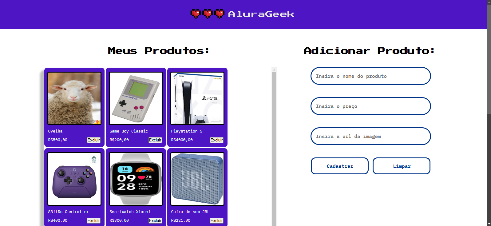

<h1>AluraGeek</h1>

<h2>Sobre</h2>

Projeto de Loja simples que conta com a adição e exclusão de produtos através do consumo de uma API Mockada

<h2>Detalhes</h2>
<ul>
<li>O projeto utiliza uma database em JSON para os produtos que são mostrados, adicionados e excluídos através do consumo da API Mockada</li>
<li>Para conseguir fazer o projeto funcionar integralmente é necessário um servidor local json-server e rodar o comando "json-server --watch db.json"</li>
<li>CSS construido para se adaptar tamanhos de tela diferentes, possuindo duas configurações</li>
</ul>

<h2>Recursos</h2>
<ul>
  <li>Responsivo para widths menores ou maiores que 1020px</li>
  <li>Adição de itens condicionada a ter os campos de nome, preço e URL da imagem preenchidos</li>
  <li>Mensagens de erro programadas para quando algumas das funções não tiverem o comportamento esperado</li>
</ul>

<h2>Mais informações</h2>

Projeto desenvolvido como requisito de qualificação da segunda fase do curso Oracle ONE, uma parceria entre a Oracle e a Alura para capacitação de desenvolvedores

<h2>Instruções para inicialização do servidor e observação do arquivo db.json</h2>

Você vai precisar ter instalado o json-server, pessoalmente eu o instalei globalmente através do comando npm install json-server@0.17.4 -g, com ele instalado você deve rodar o "npm init" no terminal, o que pessoalmente eu não fiz nesse projeto em específico, mas suspeito que se você ainda não o executou antes o projeto pode não se comportar da aneira esperada, ele vai perguntar várias opções para configurar esse pacote, aperte enter para aceitar cada uma. Continuando, executar o comando npm install json-server, e por último, execute o comando json-server --watch db.json. Se o comando "json-server --watch db.json" tiver dado certo, ele deve ter iniciado o servidor local na porta 3000. Quando quiser acessar, a URL será localhost:3000/Produtos.

Você pode ter problemas em executar esse último comando caso o sistema do computador não esteja possibilitando a execução de scripts externos, nesse caso, abra o windows powershell executando-o como administrador, e execute o comando: Set-ExecutionPolicy RemoteSigned

Ele vai perguntar se quer ajustar para todos, digite "a" e clique no botão Enter. Isso irá permitir a execução de scripts externos se não estava permitido antes. Com ele permitimos que todos os pacotes e extensões externas que forem verificadas serão possíveis de instalar no computador. Isso vai funcionar também para outros projetos que você fizer.

